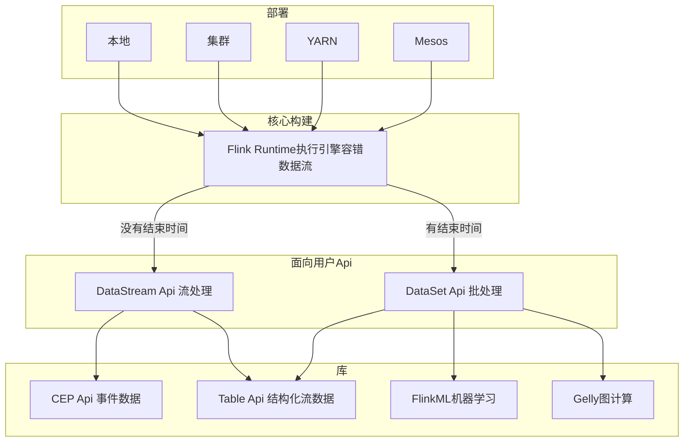
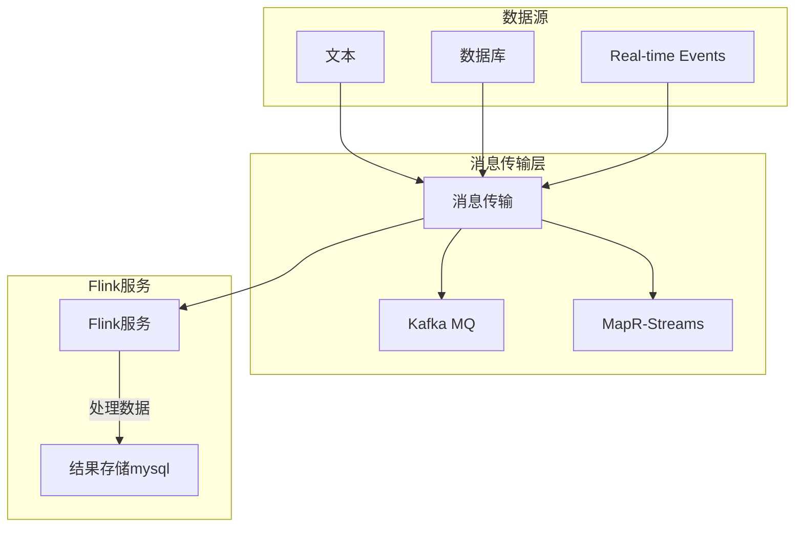
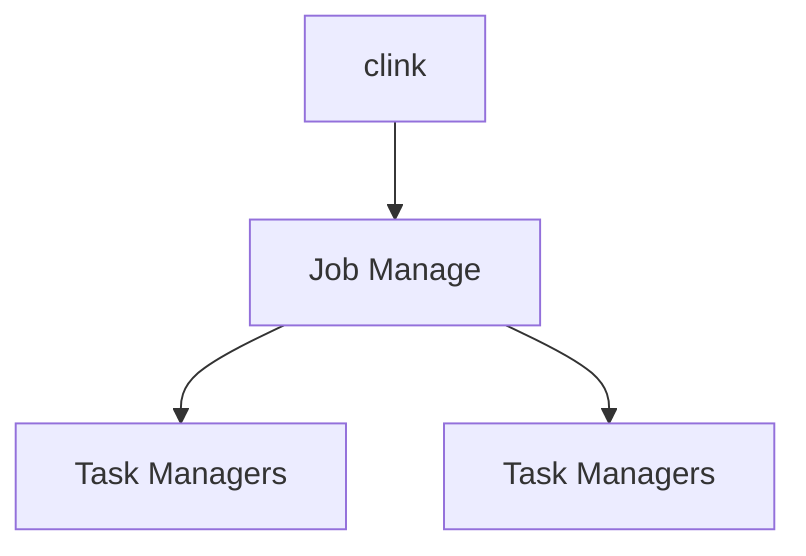

## Flink相关网站推荐
- [Fink官网](https://flink.apache.org/)
- [Fink(data-artisans)官网](https://data-artisans.com/)
- [flink学习](https://github.com/liguohua-bigdata/simple-flink)
- https://oc.flink-china.org/1.2.0/index.html
- 文档： https://flink-china.org/introduction.html#section
- 推荐阅读有赞计算实践： https://tech.youzan.com/storm-in-action

## Flink 技术核心架构




- 1.flink table：主要用于处理关系型的结构化数据，对结构化数据进行查询操作，将结构化数据抽象成关系表，并通过类SQL的DSL对关系表进行各种查询操作。
提供SQL on bigdata的功能,flink table既可以在流处理中使用SQL,也可以在批处理中使用SQL,对应sparkSQL.
- 2.flink gelly：主要用于图计算领域，提供相关的图计算API和图计算算法的实现,对应spark graph。
- 3.flink ML（machine leaning）：主要用于机器学习领域，提供了机器学习Pipelines APIh和多种机器学习算法的实现，对应sparkML
- 4.flink CEP（Complex event processing）：主要用于复杂事件处理领域。




### 物理架构

- Master (Job Manager): 处理job的提交，资源的调度，元数据的管理，运行状态监控等。
- Workers (Task Managers):分解job变成各种operation，并执行operation完成job任务。
- 数据在node之间流动，优先计算本datanode中的data block，本node没有，才考虑拉取其他node上的block。
- 所有操作都基于内存，在计算完成后可以写入各种持久化存储系统，如hdfs,hbase等。


### 特性
#### 实现了自己的内存管理机制
1.flinK在jvm内部实现了自己的内存管理机制，以提高内存使用效率，防止大规模GC.
2.flink将大规模的数据存放到out-heap内存，以防止在jvm的heap中创建大量对象，而引起大规模GC.

#### 同一个运行时环境，同时支持流处理，批处理
1.flink的一套runtime环境，统一了流处理，批处理，两大业务场景
2.flink本质是一个流处理系统，同时它将批处理看出特殊的流处理，因此也能应付批处理的场景

#### 支持迭代和增量迭代
1.flinK支持迭代和增量迭代操作（这一特性在图计算和机器学习领域非常有用）
2.增量迭代可以根据计算的依赖关系，优化计算环境，获得最好的计算效率


#### 支持程序优化
1.flink的批处理场景下可以根据计算的依赖关系，自动的避免一些昂贵的不必要的中间操作（诸如：sort,shuffle等）
2.flink会自动缓存一些中间结果，以便后续计算的多次使用，这样能显著的提高效率。

## 窗口
- 事件时间(事件发生本身记录的时间)
- 处理时间(处理事件的机器所测量的时间)
[Event Time推荐阅读](https://www.jianshu.com/p/68ab40c7f347)

### 时间窗口
#### 每一分钟滚动窗口,计算最近一分钟的数值总和
```java
stream.timeWindow(Time.minutes(1))
```
#### 每半分钟(30s)滚动窗口,计算最近一分钟的数值总和
```java
stream.timeWindow(Time.minutes(1),Time.seconds(30))
```

### 计数窗口
通过元素的个数来定义。
> 不建议使用计数窗口，如果元素达不到指定，窗口占用的内存就没办法释放

#### 每4滚动窗口
```java
stream.countWindow(4)
```
#### 每半2滚动窗口,计算最近4的数值总和
```java
stream.countWindow(4,2)
```

### 回话窗口
用来表示一些活动或行为阶段。如：web系统中的session
1. 在Flink中，回话窗口由超时时间设定，即希望等待多久才认为回话已经结束。
```java
/**如果用户处于非活动状态长达5分钟，则认为回话结束*/
stream.window(SessionWindows.withGap(Time.minutes(5)))
```

### 触发器
触发器控制好生成结果的时间，即何时集合窗口内容并将结果返回给用户。
每隔一窗口默认都有一个触发器。(可以实现自定义的触发器，例如每秒提供一次近似结果)

### 水印
水印由应用程序开发人员生成。
水印以事件事件说明输入数据的完整性提供了一种机制。

> 可能某些特定的元素会违背水印的条件，也就是说即使是Watermark(t)已经发生了，但是还会有许多时间戳t'<=t的事件发生。<br>
事实上，在真实的设置中，某些元素可以任意延迟，因此指定一个时间，在这个时间内所有在一个特定事件时间戳的事件都会发生是不可能的。<br>
此外，即使延迟是有界的，延迟太多的水印也是不可取的，因为会在事件时间窗口的评价中导致过多的延迟。<br>
 　　基于这个原因，流程序可以明确地指定一些延迟元素，延迟元素是指抵达的系统事件时间已经过了延迟元素时间戳的元素。<br>
 请参考[允许时延来获取更多关于如何在事件时间窗口中处理延迟元素的更多信息](https://ci.apache.org/projects/flink/flink-docs-release-1.3/dev/windows.html#allowed-lateness)。


## exactly-one
是指系统保证在发生故障后得到计数结果与正确指一致。

### 检查点(checkpoint barrier)
- 检查点用来保障exactly-one，在出现故障时将系统重置会正确的状态。
- 通过特殊标记，标记不进行运算。
- 检查点由flink自动生成，用来在出现故障时记录重新处理，从而修正状态。
- 检查点会被持久化存储在数据库中

### 保存点(savepoint)
- 保持点可以被是为作业在某一特定时间点的快照(该时间点即为保存点被触发的时间点)
- 保存点与检查点的作业方式完全相同，只不过它由用户通过Flink命令工具或者Web控制台手动触发。
- 保存点会被持久化存储在数据库中。

### 保存点可以解决那些问题

- 应用程序代码升级:假设你在已经处于运行状态的应用程序中发现了个bug,
  并且希望之后的事件都可以用修复后的新版本来处理。通过触发保存点并从该保存点处运行新版本,
  下游的应用程序并不会察觉到不同(当然,被更新的部分除外)。

- Fink版本更新: Flink自身的更新也变得简单,因为可以针对正在运行的任务触发保存点,并从保存点处用新版本的Fink重启任务。

- 维护和迁移:使用保存点,可以轻松地“暂停和恢复”应用程序。这对于集群维护以及向新集群迁移的作业来说尤其有用。
  此外,它还有利于开发、测试和调试,因为不需要重播整个事件流。

- 假设模拟与恢复:在可控的点上运行其他的应用逻辑,以模拟假设的场景,这样做在很多时候非常有用。

- A/B测试:从同一个保存点开始,并行地运行应用程序的两个版本,有助于进行AB测试。上述所有挑战都真实存在。
  Fink内部的检查点机制以保存点的形式呈现给气户,用来应对上述挑战。这反映了Fnk检查点本质上是一个可持续升有状态的计算
